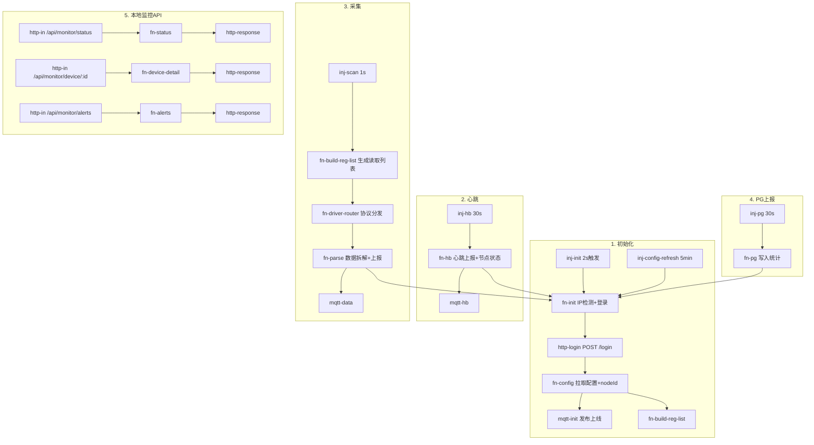

# EdgeLink 边缘采集系统 — 详细设计说明书

> **版本**: v8.0 (P0-FIX)  
> **日期**: 2026-06-22  
> **核心设计理念**: 后端配置驱动 · 前端协议可插拔 · 边缘零代码部署

---

## 目录

1. [系统总体架构](#一系统总体架构)
2. [数据库设计 — MySQL 配置库](#二数据库设计--mysql-配置库)
3. [数据库设计 — PostgreSQL 时序库](#三数据库设计--postgresql-时序库)
4. [后端 API 接口清单 — FastAPI](#四后端-api-接口清单--fastapi)
5. [Node-RED Flow 详细设计](#五node-red-flow-详细设计)
6. [字段逻辑字典](#六字段逻辑字典)
7. [数据流向图](#七数据流向图)
8. [RBAC 权限与审计](#八rbac-权限与审计)
9. [部署与运维设计](#九部署与运维设计)

---

## 一、系统总体架构

### 1.1 四层架构图

```
┌──────────────────────────────────────────────────────────────────┐
│  RuoYi配置层 (Web Admin)                                         │
│  Vue2 + Element UI  │  FastAPI  │  RBAC 权限  │  设备/点位配置   │
│  http://中心服务器:9099                                          │
└──────────────┬───────────────────────────────────────────────────┘
               │ HTTP/REST (JWT Auth) 
               ▼
┌──────────────────────────────────────────────────────────────────┐
│  MySQL 配置库 (中心)          PostgreSQL 时序库 (中心/边缘)       │
│  plc_device, plc_tag,         device_data (hypertable)           │
│  nodered_node, heartbeat_log, alarm_log, node_status             │
│  sys_user, sys_dept, sys_menu                                   │
└──────────────┬───────────────────────────────────────────────────┘
               │ HTTP/REST + MQTT
               ▼
┌──────────────────────────────────────────────────────────────────┐
│  Node-RED 采集引擎 (边缘工控机 × N 台)                            │
│  ┌──────────┐ ┌──────────┐ ┌──────────┐ ┌──────────┐            │
│  │ fn-init  │ │ fn-config│ │ fn-hb    │ │ fn-pg    │ ← 编排层   │
│  │ 自动发现 │ │ 拉取配置 │ │ 30s心跳  │ │ PG统计   │   不变      │
│  └──────────┘ └──────────┘ └──────────┘ └──────────┘            │
│       │              │           │            │                  │
│       ▼              ▼           ▼            ▼                  │
│  ┌──────────────────────────────────────────────┐               │
│  │          fn-driver-router (驱动路由器)        │               │
│  │  DRIVERS = { MC_Protocol, Modbus_TCP, ... }  │ ← 可插拔     │
│  └──────────────────────────────────────────────┘               │
│       │                                                          │
│       ▼                                                          │
│  ┌──────────────────────────────────────────────┐               │
│  │          fn-parse (协议无关解析)               │               │
│  │  stdData[tagId] → 工程换算 → HTTP/MQTT上报    │               │
│  └──────────────────────────────────────────────┘               │
│                                                                  │
│  本地监控屏: http://localhost:1880/index.html                    │
└──────────────┬───────────────────────────────────────────────────┘
               │ TCP/MC 3E/4E  │  TCP/Modbus  │  OPC UA (待扩展)
               ▼
┌──────────────────────────────────────────────────────────────────┐
│  PLC 设备层                                                      │
│  三菱 Q/L/FX 系列  │  Siemens S7  │  Modbus 设备  │  OPC UA     │
└──────────────────────────────────────────────────────────────────┘
```

### 1.2 通信协议

```
┌──────────────┬──────────────────────┬─────────────────────────┐
│     链路     │        协议          │          用途           │
├──────────────┼──────────────────────┼─────────────────────────┤
│ 采集PC → RuoYi│  HTTP/REST (JWT)    │ 登录、拉取配置、上报    │
│ Node-RED → EMQX│ MQTT (QoS 1)       │ 数据推送、告警、心跳    │
│ EMQX → 后端   │  MQTT Client        │ 后端订阅消费            │
│ 驱动 → PLC    │  TCP/MC 3E/4E       │ 三菱 PLC 寄存器读写     │
│ 驱动 → PLC    │  TCP/Modbus         │ Modbus 设备读写(待实现) │
│ 浏览器 → NR   │  HTTP               │ 本地监控屏              │
└──────────────┴──────────────────────┴─────────────────────────┘
```

### 1.3 现场部署环境

```
┌─────────────────────────────────────────┐
│         Windows 10/11 工控机            │
│                                         │
│  NIC1: 192.168.1.x  (办公网)            │
│    ├── 访问 RuoYi 后端 :9099            │
│    ├── 访问 EMQX :1883                  │
│    └── 本地监控屏 :1880                 │
│                                         │
│  NIC2: 192.168.2.x  (工业网)            │
│    └── 连接 PLC (MC/Modbus TCP)         │
│                                         │
│  D:\nodered\                            │
│    ├── node.exe                         │
│    ├── start.bat                        │
│    └── data\                            │
│        ├── settings.js                  │
│        ├── flows.json                   │
│        └── static\index.html            │
└─────────────────────────────────────────┘
```

---

## 二、数据库设计 — MySQL 配置库

### 2.1 设备表 `plc_device`

| 字段名 | 类型 | 可空 | 默认值 | 注释 |
|--------|------|------|--------|------|
| `id` | BIGINT | N | AUTO_INC | 设备ID |
| `device_name` | VARCHAR(100) | N | — | 设备名称（唯一） |
| `device_code` | VARCHAR(50) | Y | NULL | 设备编号（如 PLC-Q-01） |
| `plc_brand` | VARCHAR(50) | N | 'Mitsubishi' | PLC品牌 |
| `plc_series` | VARCHAR(50) | Y | NULL | 系列（Q/L/FX/iQ-R） |
| `com_type` | VARCHAR(50) | Y | NULL | **通信协议**：MC_Protocol / Modbus_TCP / OPC_UA / S7_TCP |
| `plc_ip` | VARCHAR(50) | Y | NULL | PLC的工业网IP（RS-232C时可为空） |
| `plc_port` | INT | N | 5007 | PLC端口号 |
| `host_pc_ip` | VARCHAR(50) | Y | NULL | **归属采集PC的办公网IP**（核心字段） |
| `backup_pc_ip` | VARCHAR(50) | Y | NULL | 备用采集PC IP |
| `mes_ip` | VARCHAR(50) | Y | NULL | MES/MDPS对接IP |
| `mes_port` | INT | N | 0 | MES对接端口 |
| `mc_frame` | VARCHAR(10) | Y | NULL | MC帧格式（3E/4E） |
| `station_no` | INT | N | 0 | 站号 |
| `network_no` | INT | N | 0 | 网络号 |
| `scan_interval_ms` | INT | N | 1000 | 采集周期（毫秒） |
| `comm_timeout_ms` | INT | N | 3000 | 通信超时（毫秒） |
| `retry_count` | INT | N | 2 | 失败重试次数 |
| `retry_interval_ms` | INT | N | 500 | 重试间隔（毫秒） |
| `trigger_kind` | INT | N | 0 | 触发方式（0=握手 1=固定周期 2=变化触发） |
| `protocol_params` | JSON | Y | NULL | **P1新增**：协议专用参数（Modbus: unit_id/function_code; OPC UA: node_id; S7: rack/slot） |
| `status` | CHAR(1) | N | '0' | **0=启用 1=停用** |
| `del_flag` | CHAR(1) | N | '0' | **0=正常 2=删除**（软删除） |
| `create_by` | VARCHAR(64) | Y | NULL | 创建者 |
| `create_time` | DATETIME | Y | NULL | 创建时间 |
| `update_by` | VARCHAR(64) | Y | NULL | 更新者 |
| `update_time` | DATETIME | Y | NULL | 更新时间 |
| `remark` | VARCHAR(500) | Y | NULL | 备注 |

**索引**: `idx_plc_device_del_flag`, `idx_plc_device_status`, `idx_plc_device_host_pc_ip`

**业务规则**:
- `host_pc_ip` 决定设备归属哪台采集PC。Node-RED启动时自动检测本机IP，后端只返回匹配的设备
- `status='0'` 启用采集，`status='1'` 停用（数据保留但Node-RED不读）
- `protocol_params` 为JSON扩展列，避免新增协议时频繁ALTER TABLE

### 2.2 点位表 `plc_tag`

| 字段名 | 类型 | 可空 | 默认值 | 注释 |
|--------|------|------|--------|------|
| `id` | BIGINT | N | AUTO_INC | 点位ID |
| `device_id` | BIGINT | N | — | **FK → plc_device.id** |
| `tag_name` | VARCHAR(100) | N | — | 点位名称 |
| `register_type` | VARCHAR(10) | N | — | **寄存器类型（协议相关）**：MC=D/W/X/Y/M，Modbus=Coil/Discrete/Holding/Input |
| `register_address` | VARCHAR(50) | N | — | 寄存器地址（如 D100, 40001, ns=2;s=TagName） |
| `data_type` | VARCHAR(20) | N | — | 数据类型：INT16 / UINT16 / INT32 / FLOAT32 / BIT |
| `unit` | VARCHAR(20) | Y | NULL | 原始单位 |
| `description` | TEXT | Y | NULL | 点位描述 |
| `status` | CHAR(1) | N | '0' | **0=启用 1=停用** |
| `sort_order` | INT | N | 0 | 排序号 |
| `transform_type` | VARCHAR(20) | N | 'none' | 换算类型：none / linear / slope_offset |
| `transform_slope_a` | FLOAT | N | 1.0 | 斜率/乘数 a |
| `transform_offset_b` | FLOAT | N | 0.0 | 偏移量 b |
| `raw_value_min` | FLOAT | Y | NULL | 原始值有效范围下限 |
| `raw_value_max` | FLOAT | Y | NULL | 原始值有效范围上限 |
| `eng_value_min` | FLOAT | Y | NULL | 工程值下限 |
| `eng_value_max` | FLOAT | Y | NULL | 工程值上限 |
| `eng_unit` | VARCHAR(20) | Y | NULL | 工程单位（换算后的显示单位） |
| `report_deadband_ms` | INT | N | 1000 | 变化上报死区（ms） |
| `report_force_interval_ms` | INT | N | 5000 | 强制上报间隔（ms） |
| `quality_enabled` | CHAR(1) | N | '1' | 是否启用质量码（0=关闭 1=启用） |
| `protocol_params` | JSON | Y | NULL | **P1新增**：协议专有点位参数 |
| `bit_offset` | INT | Y | NULL | **P3新增**：位偏移（BIT类型时有效，0-15） |
| `byte_order` | VARCHAR(10) | Y | NULL | **P3新增**：字节序（LITTLE_ENDIAN/BIG_ENDIAN） |
| `word_order` | VARCHAR(10) | Y | NULL | **P3新增**：字序（LOW_FIRST/HIGH_FIRST） |
| `del_flag` | CHAR(1) | N | '0' | 软删除标志 |

**索引**: `idx_plc_tag_device_id`, `idx_plc_tag_del_flag`, `idx_plc_tag_status`

**核心换算公式**:
```
eng_value = raw_value × transform_slope_a + transform_offset_b  (transform_type = slope_offset/linear)
eng_value = raw_value                                           (transform_type = none)
```

### 2.3 采集节点表 `nodered_node`

| 字段名 | 类型 | 可空 | 默认值 | 注释 |
|--------|------|------|--------|------|
| `id` | INT | N | AUTO_INC | 节点ID（后端自动分配） |
| `node_name` | VARCHAR(100) | N | — | 节点名称（默认 PC-{IP}） |
| `office_net_ip` | VARCHAR(50) | N | — | 办公网IP（唯一键） |
| `indust_net_ip` | VARCHAR(50) | Y | NULL | 工业网IP |
| `host_pc_ip` | VARCHAR(50) | N | — | 归属IP |
| `status` | INT | N | 1 | 1=在线 0=离线 |
| `last_heartbeat` | DATETIME | Y | NULL | 最后心跳时间 |
| `heartbeat_interval` | INT | N | 30 | 心跳间隔（秒） |
| `remark` | VARCHAR(500) | Y | NULL | 备注 |
| `created_at` | DATETIME | N | NOW | 首次注册时间 |
| `updated_at` | DATETIME | N | NOW | 更新时间 |

**自动注册**: Node-RED首次心跳时，后端根据 `host_pc_ip` 自动 upsert 此表记录

### 2.4 心跳日志表 `heartbeat_log`

| 字段名 | 类型 | 注释 |
|--------|------|------|
| `id` | BIGINT | 日志ID |
| `node_id` | INT | FK → nodered_node.id |
| `report_time` | DATETIME | 上报时间 |
| `node_ip` | VARCHAR(50) | 上报IP |
| `running_flows` | INT | 运行流数量 |
| `memory_usage_mb` | INT | 内存占用MB |

### 2.5 设备通信状态表 `device_comm_status`

| 字段名 | 类型 | 注释 |
|--------|------|------|
| `id` | INT | 记录ID |
| `node_id` | INT | FK → nodered_node.id |
| `device_id` | INT | FK → plc_device.id |
| `online` | INT | 1=在线 0=离线 |
| `last_success_time` | DATETIME | 最后成功通信时间 |
| `last_error_time` | DATETIME | 最后错误时间 |
| `error_msg` | VARCHAR(500) | 错误信息 |
| `consecutive_fails` | INT | 连续失败次数 |

### 2.6 PG写入状态表 `pg_write_status`

| 字段名 | 类型 | 注释 |
|--------|------|------|
| `id` | INT | 记录ID |
| `node_id` | INT | FK → nodered_node.id |
| `last_write_time` | DATETIME | 最后写入时间 |
| `write_latency_ms` | INT | 写入延迟（ms） |
| `today_write_count` | INT | 当日写入计数 |
| `consecutive_fails` | INT | 连续失败次数 |
| `error_msg` | VARCHAR(500) | 错误信息 |

### 2.7 告警表 `monitor_alert`

| 字段名 | 类型 | 注释 |
|--------|------|------|
| `id` | INT | 告警ID |
| `alert_type` | VARCHAR(50) | 告警类型：PLC_OFFLINE / NODE_OFFLINE / PG_WRITE_LAG |
| `node_id` | INT | 关联节点 |
| `device_id` | INT | 关联设备（可为NULL） |
| `alert_msg` | VARCHAR(500) | 告警消息 |
| `status` | INT | 0=未处理 1=已确认 2=已解决 |
| `first_time` | DATETIME | 首次告警时间 |
| `last_time` | DATETIME | 最近告警时间 |
| `resolved_time` | DATETIME | 解决时间 |
| `confirmed_by` | VARCHAR(64) | 确认人 |

### 2.8 权限表（RuoYi 框架自带）

| 表名 | 用途 |
|------|------|
| `sys_user` | 用户表（用户名、密码bcrypt、部门、角色） |
| `sys_dept` | 部门表（树形结构） |
| `sys_role` | 角色表 |
| `sys_menu` | 菜单权限表 |
| `sys_oper_log` | 操作日志表 |

### 2.9 表关联关系

```
plc_device (1) ──────< (N) plc_tag           [device_id FK]
nodered_node (1) ────< (N) heartbeat_log      [node_id FK]
nodered_node (1) ────< (N) device_comm_status [node_id FK]
plc_device (1) ──────< (N) device_comm_status [device_id FK]
nodered_node (1) ────< (N) pg_write_status    [node_id FK]
nodered_node (1) ────< (N) monitor_alert      [node_id FK]
```

### 2.10 关键状态字段取值说明

| 字段 | 取值 | 含义 | 业务行为 |
|------|------|------|----------|
| `plc_device.status` | `'0'` | 启用 | Node-RED采集 |
| | `'1'` | 停用 | 数据保留但停止采集 |
| `plc_tag.status` | `'0'` | 启用 | 纳入读取列表 |
| | `'1'` | 停用 | 跳过不读 |
| `del_flag` | `'0'` | 正常 | — |
| | `'2'` | 已删除 | DAO层自动过滤 |
| `quality` | `0` | GOOD | 数据可靠 |
| | `1` | BAD | 数据异常（离线缓存复用） |
| | `2` | UNCERTAIN | 值超范围/溢出 |

---

## 三、数据库设计 — PostgreSQL 时序库

### 3.1 超表 `device_data`

```sql
CREATE TABLE device_data (
    time        TIMESTAMPTZ NOT NULL,
    node_id     INT NOT NULL,
    device_id   INT NOT NULL,
    tag_id      INT NOT NULL,
    raw_value   DOUBLE PRECISION,
    eng_value   DOUBLE PRECISION,
    quality     SMALLINT DEFAULT 0,
    unit        VARCHAR(20)
);

SELECT create_hypertable('device_data', 'time',
    chunk_time_interval => INTERVAL '7 days'
);

-- 压缩策略：7天后压缩
SELECT add_compression_policy('device_data', INTERVAL '7 days');
```

### 3.2 超表 `alarm_log`

```sql
CREATE TABLE alarm_log (
    time        TIMESTAMPTZ NOT NULL,
    node_id     INT NOT NULL,
    device_id   INT,
    alert_type  VARCHAR(50) NOT NULL,
    alert_msg   VARCHAR(500),
    resolved    BOOLEAN DEFAULT FALSE
);

SELECT create_hypertable('alarm_log', 'time',
    chunk_time_interval => INTERVAL '1 month'
);
```

### 3.3 超表 `node_status`

```sql
CREATE TABLE node_status (
    time            TIMESTAMPTZ NOT NULL,
    node_id         INT NOT NULL,
    memory_usage_mb INT,
    running_flows   INT,
    device_count    INT
);

SELECT create_hypertable('node_status', 'time',
    chunk_time_interval => INTERVAL '1 month'
);
```

### 3.4 与 MySQL 的映射

```
MySQL plc_device.id  ←→  PG device_data.device_id
MySQL plc_tag.id     ←→  PG device_data.tag_id
MySQL nodered_node.id←→  PG device_data.node_id
```

通过 `device_id`、`tag_id`、`node_id` 关联，不做外键（跨库）。

---

## 四、后端 API 接口清单 — FastAPI

### 4.1 M01 — 设备管理 `prefix=/plc/device`

| 方法 | 路径 | 说明 | 权限 |
|------|------|------|------|
| `GET` | `/list` | 设备分页列表（含点位计数） | plc:device:list |
| `GET` | `/{id}` | 设备详情（含点位列表） | plc:device:query |
| `POST` | `/` | 新增设备 | plc:device:add |
| `PUT` | `/` | 编辑设备 | plc:device:edit |
| `DELETE` | `/{ids}` | 软删除设备（级联删除点位） | plc:device:remove |
| `PUT` | `/disable/{ids}` | 停用设备 | plc:device:edit |
| `POST` | `/clone` | 克隆设备（含点位） | plc:device:add |
| `GET` | `/export` | 导出Excel | plc:device:export |

### 4.2 M02 — 点位管理 `prefix=/plc/tag`

| 方法 | 路径 | 说明 | 权限 |
|------|------|------|------|
| `GET` | `/list` | 点位分页列表 | plc:tag:list |
| `GET` | `/{id}` | 点位详情 | plc:tag:query |
| `POST` | `/` | 新增点位 | plc:tag:add |
| `PUT` | `/` | 编辑点位 | plc:tag:edit |
| `DELETE` | `/{ids}` | 软删除点位 | plc:tag:remove |
| `PUT` | `/disable/{ids}` | 停用点位 | plc:tag:edit |
| `POST` | `/batch-update` | 批量更新点位字段 | plc:tag:edit |
| `POST` | `/import` | 导入Excel | plc:tag:import |
| `GET` | `/export` | 导出Excel | plc:tag:export |

### 4.3 M03 — Node-RED 专用（配置拉取）

**`GET /plc/tag/global/list?page_size=10000`** — **核心接口**
> 跨设备全局点位查询，JOIN plc_device 返回所有设备级字段
> 
> **Auth**: JWT Bearer Token
> 
> 响应:
> ```json
> {
>   "code": 200,
>   "rows": [{
>     "id": 29, "deviceId": 23, "tagName": "温度",
>     "registerType": "D", "registerAddress": "100",
>     "dataType": "INT16",
>     "transformType": "linear", "transformSlopeA": 0.1, "transformOffsetB": 0,
>     "engUnit": "℃",
>     "deviceName": "test1", "hostPcIp": "192.168.1.3",
>     "plcIp": "127.0.0.1", "plcPort": 5007,
>     "comType": "MC_Protocol", "mcFrame": "3E", "plcSeries": "Q",
>     "stationNo": 0, "networkNo": 0,
>     "scanIntervalMs": 1000, "commTimeoutMs": 3000,
>     "retryCount": 2, "retryIntervalMs": 500,
>     "triggerKind": 1, "status": "0",
>     "protocolParams": null,
>     "bitOffset": null, "byteOrder": null, "wordOrder": null
>   }]
> }
> ```

### 4.4 M04 — Node-RED 上报（API Key + JWT 双重保护）

**`POST /monitor/heartbeat?host_pc_ip=&node_ip=&running_flows=&memory_usage_mb=`**
> 心跳上报，自动注册新节点，返回 nodeId
> 
> **Auth**: X-API-Key + JWT
> 
> 响应: `{"code": 200, "data": {"node_id": 56}}`

**`POST /monitor/device-comm?node_id=&device_id=&success=&error_msg=`**
> PLC通信状态上报
> 
> **Auth**: X-API-Key + JWT

**`POST /monitor/pg-write?node_id=&success=&latency_ms=&write_count=&device_count=&error_msg=`**
> PG写入统计上报
> 
> **Auth**: X-API-Key + JWT

### 4.5 M05 — 监控管理 `prefix=/monitor`

| 方法 | 路径 | 说明 | 权限 |
|------|------|------|------|
| `GET` | `/nodes` | 采集节点列表（含PLC状态） | monitor:center:list |
| `GET` | `/alerts` | 告警列表 | monitor:center:list |
| `PUT` | `/alerts/{id}/confirm` | 确认告警 | monitor:center:list |
| `GET` | `/kpi` | KPI仪表盘 | monitor:center:list |

### 4.6 M06 — 登录认证

**`POST /login`**
> Content-Type: application/x-www-form-urlencoded
> 
> 请求: `username=admin&password=***`
> 
> 响应: `{"code": 200, "token": "eyJ...", "success": true}`

---

## 五、Node-RED Flow 详细设计

### 5.1 Flow 节点拓扑



### 5.2 Function 节点职责

| 节点 | 职责 | 输入 | 输出 | 改动频率 |
|------|------|------|------|----------|
| `fn-init` | IP自动检测、登录参数组装、状态初始化、重登/刷新路径控制 | inject触发 / reauth消息 | `msg.payload=username=&password=` | 极低 |
| `fn-config` | 解析JWT、反查nodeId（heartbeat）、拉取全局点位、按hostPcIp筛选设备、发布MQTT上线 | JWT token | `mcSim_devices`, `mcSim_tagConfigs` | 极低 |
| `fn-hb` | HTTP心跳上报（含内存占用）、MQTT心跳发布、JWT过期检测、nodeId更新 | inject 30s | MQTT消息 + 可选reauth | 极低 |
| `fn-build-reg-list` | 从global读取设备列表、附加driverType、控制采集间隔 | inject 1s | `msg.devices[]` | 极低 |
| **`fn-driver-router`** | **按comType动态分发到driver函数、标准化输出** | `msg.devices[]` | `msg.results[]` | **加协议时改DRIVERS** |
| `fn-parse` | 按tagId取标准化数据、工程换算、HTTP上报、MQTT发布、告警缓存 | `msg.results[]` | MQTT数据 | **不改** |
| `fn-pg` | PG写入计数统计上报 | inject 30s | HTTP请求 | 极低 |
| `fn-status` | 本地监控API：节点状态汇总 | HTTP GET | JSON | 不改 |
| `fn-device-detail` | 本地监控API：设备详情+最新点位 | HTTP GET | JSON | 不改 |
| `fn-alerts` | 本地监控API：最近告警 | HTTP GET | JSON | 不改 |

### 5.3 全局变量清单

| 变量名 | 类型 | 默认值 | 作用 | 生命周期 | 设置者 |
|--------|------|--------|------|----------|--------|
| `mcSim_configReady` | bool | false | 配置是否就绪（控制采集启停） | Flow运行期 | fn-config |
| `mcSim_devices` | array | [] | 本机管理的设备列表 | Flow运行期 | fn-config |
| `mcSim_tagConfigs` | object | {} | 每设备的点位配置 `{deviceId: [tags]}` | Flow运行期 | fn-config |
| `mcSim_hostPcIp` | string | 127.0.0.1 | 本机办公网IP | Flow运行期 | fn-init自动检测 |
| `mcSim_nodeId` | int | 0→反查 | 本节点ID | Flow运行期 | fn-config→heartbeat |
| `mcSim_jwtToken` | string | '' | JWT令牌 | 24h过期 | fn-config / fn-hb |
| `mcSim_devCommStatus` | object | {} | 设备通信状态 `{deviceId: {consecutiveFails, lastAlarmTime}}` | Flow运行期 | fn-parse |
| `mcSim_lastGoodTags` | object | {} | 上次成功采集的点位值 `{deviceId: [tagValues]}` | Flow运行期 | fn-parse |
| `mcSim_lastAlarmTime` | object | {} | 告警抑制时间 `{dev_X: timestamp}` | Flow运行期 | fn-driver-router |
| `mcSim_recentAlerts` | array | [] | 本地告警缓存（最近20条） | Flow运行期 | fn-parse |
| `mcSim_startTime` | string | ISO时间 | 采集启动时间 | Flow运行期 | fn-status |
| `mcSim_reauthInProgress` | bool | false | 重登进行中（防重复触发） | Flow运行期 | 多个节点 |
| `mcSim_driverRegistry` | object | {MC_Protocol→..., Modbus_TCP→...} | 驱动类型映射 | settings.js或默认 | fn-build-reg-list |

### 5.4 驱动框架设计（v8 协议可插拔）

#### 标准化驱动契约

```
输入契约:
{
  deviceId: int,        deviceName: string,    comType: string,
  connection: {ip, port},
  protocolParams: {mcFrame, stationNo, networkNo, plcSeries, ...},
  tags: [{id, addr, regAddr, regType, dataType, tform, slope, offset}],
  timeout: int,         maxRetries: int,       retryInterval: int
}

输出契约:
{
  deviceId: int,        deviceName: string,    success: bool,
  data: {
    [tagId]: { rawValue: number, quality: 0|1|2, ts: string }
  },
  error: string|null,   plcIp: string,         plcPort: int,
  driverType: string
}
```

#### DRIVERS 注册表（fn-driver-router 内）

```javascript
var DRIVERS = {
    'MC_Protocol': driverMCProtocol,    // 三菱 MC 3E/4E 帧，原生TCP
    'Modbus_TCP': driverModbusTCP,      // Modbus TCP（待实现）
    // 'OPC_UA': driverOPCUA,           // 未来扩展
    // 'S7_TCP': driverS7Protocol,      // 未来扩展
};
```

#### DRIVER_REGISTRY 映射（fn-build-reg-list 内）

```javascript
var DRIVER_REGISTRY = {
    'MC_Protocol': 'driver-mc-protocol',
    'Modbus_TCP': 'driver-modbus-tcp',
};
```

#### 新增协议的步骤

```
1. 在 fn-driver-router 的 DRIVERS 对象中注册一个新的 driver 函数
   └── 遵循标准化输入/输出契约
2. 在 fn-build-reg-list 的 DRIVER_REGISTRY 中加一行 comType 映射
3. 在 settings.js functionGlobalContext 中暴露协议库（如 modbus: require('modbus-serial')）
4. 在后端 plc_device 表加设备记录，comType 填新协议名
5. 编排层（fn-config / fn-hb / fn-parse / fn-pg / fn-status）一行不改
```

#### 当前 MC 驱动能力

```
帧格式: 3E / 4E
寄存器: D / W / X / Y / M / L / B / R
批量优化: 按寄存器类型分组 + MAX_GAP=20 聚类切分
模拟模式: mcSim_simulationMode=true 时跳过TCP，生成随机数据
```

---

## 六、字段逻辑字典

### 6.1 设备字段

| 字段 | 前端配置（Vue） | Node-RED读取 | PLC通信映射 |
|------|----------------|-------------|------------|
| `com_type` | 下拉框：MC_Protocol / Modbus_TCP | `dev.comType` → DRIVERS路由键 | 选择driver函数 |
| `mc_frame` | v-show="comType===MC_Protocol" | `protocolParams.mcFrame` | MC帧构造（3E=0x50/4E=0x54） |
| `plc_ip` | 文本输入 | `dev.connection.ip` | TCP connect(ip, port) |
| `plc_port` | 数字输入 | `dev.connection.port` | TCP connect(ip, port) |
| `host_pc_ip` | 文本输入 | `dev.hostPcIp` → 与本地IP比对 | 决定设备归属 |
| `scan_interval_ms` | 数字输入 | `dev.scanIntervalMs` → 控制采集频率 | inject repeat间隔 |
| `comm_timeout_ms` | 数字输入 | `dev.timeout` → 驱动socket.setTimeout | TCP读取超时 |
| `retry_count` | 数字输入 | `dev.maxRetries` → 驱动重试上限 | 失败后最多重试N次 |
| `trigger_kind` | 数字输入 | `dev.triggerKind` | 0=握手 1=固定周期 2=变化触发(未实现) |
| `station_no` | 数字输入 | `protocolParams.stationNo` | MC帧Byte6 |
| `network_no` | 数字输入 | `protocolParams.networkNo` | MC帧（4E）Byte2-3 |
| `protocol_params` | JSON编辑器（待P2） | `dev.protocolParams` — 协议通用 | Modbus: unit_id/function_code |

### 6.2 点位字段

| 字段 | 前端配置 | Node-RED读取 | PLC通信映射 |
|------|---------|-------------|------------|
| `register_type` | 下拉框（协议动态） | `tag.regType` | MC: D/W/X/Y/M → 软元件代码 0xA8/0xB4/0x9C/0x9D/0x90 |
| `register_address` | 文本输入 | `tag.addr` (parseInt) / `tag.regAddr` | MC帧起始地址(3字节LE) |
| `data_type` | 下拉框：INT16/UINT16/INT32/FLOAT32/BIT | `tag.dtype`（暂未使用，默认为INT16） | 决定解析位数和byte_order |
| `transform_type` | 下拉框：none/linear/slope_offset | `tag.tform` → 选择换算公式 | — |
| `transform_slope_a` | 数字 | `tag.slope` | eng = raw × slope + offset |
| `transform_offset_b` | 数字 | `tag.offset` | eng = raw × slope + offset |
| `eng_unit` | 文本 | `tag.unit` | 显示用 |
| `bit_offset` | 数字（P3新增） | `tag.protocolParams.bitOffset` | BIT类型位掩码 |
| `byte_order` | 下拉框（P3新增） | `tag.protocolParams.byteOrder` | INT32/FLOAT字节序 |

### 6.3 状态与质量字段

| 字段 | 取值 | 设置者 | 含义 |
|------|------|--------|------|
| `plc_device.status` | `'0'` = 启用, `'1'` = 停用 | 后端 | Node-RED只采集status='0'的设备 |
| `plc_tag.status` | `'0'` = 启用, `'1'` = 停用 | 后端 | 已停用点位不纳入读取列表 |
| `del_flag` | `'0'` = 正常, `'2'` = 删除 | DAO层 | 所有查询默认加 del_flag='0' |
| `quality` | `0` = GOOD | 驱动 | 数据正常 |
| | `1` = BAD | fn-parse | 离线时复用上次缓存值 |
| | `2` = UNCERTAIN | 驱动 | rawValue超INT16范围(>32767或<-32768) |
| `nodered_node.status` | `1` = 在线, `0` = 离线 | 后端 | lastHeartbeat在60s内为在线 |
| `device_comm_status.online` | `1` = 在线, `0` = 离线 | fn-parse | consecutiveFails=0为在线 |

---

## 七、数据流向图

### 7.1 正常采集流程

```
PLC(D100=125.0)
  │
  │ TCP 3E Frame: 50 00 00 FF FF 03 00 0C 00 10 00 01 04 00 00 64 00 00 00 A8 02 00
  ▼
driverMCProtocol() ← fn-driver-router
  │ 1. 构建3E帧 → 发送
  │ 2. 接收响应 → parseMCResponse → {D100: 1250, D101: 321}
  │ 3. 按tagId映射 → {29: {rawValue:1250, quality:0, ts:"..."}}
  ▼
fn-parse (协议无关)
  │ 1. stdData[29].rawValue = 1250
  │ 2. eng = 1250 × 0.1 + 0 = 125.0  (tag29: slope=0.1)
  │ 3. lastGoodTags[23] = [{tag_id:29, raw_value:1250, eng_value:125.0, quality:0}]
  │
  ├──→ HTTP POST /monitor/device-comm?node_id=56&device_id=23&success=true
  ├──→ MQTT: edgelink/data/56/23 {values: [{tag_id:29, ...}]}
  │         ↓
  │       EMQX Broker
  │         ↓
  │       后端 Subscriber → PG device_data INSERT
  └──→ 本地监控屏 GET /api/monitor/device/23 → 返回 latestValues
```

### 7.2 异常流程（TCP超时）

```
driverMCProtocol() 连接 127.0.0.1:5007
  │
  ├── connect() 成功 → write(3E frame)
  │   └── client.setTimeout(1000ms)
  │        └── 1秒内无响应 → 'timeout' 事件
  │             └── attempt < maxRetries ?
  │                  ├── YES → retryInterval后重试
  │                  └── NO  → done({success:false, error:'TCP timeout'})
  │
  ▼
fn-driver-router done回调
  │ result.shouldAlarm = (now - lastAlarm[dev_23] >= 60000)  // 60s抑制
  │
  ▼
fn-parse
  │ consecutiveFails++
  │ HTTP POST device-comm?success=false&error_msg=TCP timeout
  │ shouldAlarm=true → MQTT PLC_OFFLINE告警
  │ 有缓存值? → 标记quality=1(BAD) → MQTT继续发缓存数据
  │
  ▼
本地监控屏: 该设备显示红色 ● 离线 + 连续失败次数
```

### 7.3 配置刷新流程

```
RuoYi 后台修改 plc_device 或 plc_tag
  │
  │ (Node-RED不感知，继续采集)
  ▼
5分钟后 inj-config-refresh 触发
  │
  ▼
fn-init (isRefresh=true)
  │ → global.set('mcSim_reauthInProgress', false)
  │ → 推送登录 → http-login → fn-config
  │
  ▼
fn-config
  │ → 重新拉取 /plc/tag/global/list
  │ → 重新分组、筛选
  │ → global.set('mcSim_devices', newDevices)  ← 覆盖
  │ → global.set('mcSim_tagConfigs', newConfigs)
  │ → configReady 保持 true (不中断采集)
  │
  ▼
下一轮 fn-build-reg-list 自动读取新设备列表
  → 新设备加入采集（自动）
  → 移除的设备不再采集（自动）
```

---

## 八、RBAC 权限与审计

### 8.1 角色定义

| 角色 | 权限范围 | 菜单访问 |
|------|---------|----------|
| 超级管理员 (admin) | 所有权限 | 全部菜单 |
| 系统管理员 | 设备管理 + 点位管理 + 监控查看 | 设备管理、点位管理、监控中心 |
| 普通操作员 | 只读查看 | 监控中心（只看） |

### 8.2 菜单权限

| 菜单 | 权限标识 | admin | 管理员 | 操作员 |
|------|---------|-------|--------|--------|
| PLC设备管理 | plc:device | ✅ | ✅ | ❌ |
| 设备查询 | plc:device:list | ✅ | ✅ | ❌ |
| 设备新增 | plc:device:add | ✅ | ✅ | ❌ |
| 设备编辑 | plc:device:edit | ✅ | ✅ | ❌ |
| 设备删除 | plc:device:remove | ✅ | ✅ | ❌ |
| 点位查询 | plc:tag:list | ✅ | ✅ | ❌ |
| 点位新增 | plc:tag:add | ✅ | ✅ | ❌ |
| 点位编辑 | plc:tag:edit | ✅ | ✅ | ❌ |
| 点位删除 | plc:tag:remove | ✅ | ✅ | ❌ |
| 监控中心 | monitor:center:list | ✅ | ✅ | ✅ |

### 8.3 操作日志 (`sys_oper_log`)

RuoYi 框架通过 AOP 切面自动记录每次 API 调用：

| 字段 | 说明 |
|------|------|
| `oper_user` | 操作用户 |
| `oper_ip` | 操作IP |
| `oper_url` | 请求URL |
| `oper_method` | GET/POST/PUT/DELETE |
| `oper_param` | 请求参数 |
| `oper_time` | 操作时间 |
| `status` | 1=成功 0=失败 |
| `error_msg` | 失败原因 |

---

## 九、部署与运维设计

### 9.1 Windows 服务化

```bash
# 方式1: 直接双击 start.bat
D:\nodered\start.bat

# 方式2: NSSM 注册为 Windows 服务（开机自启）
nssm install EdgeLink D:\nodered\node.exe
nssm set EdgeLink AppParameters "D:\nodered\node_modules\node-red\red.js --userDir D:\nodered\data"
nssm set EdgeLink AppDirectory D:\nodered
nssm start EdgeLink

# 方式3: pm2
npm install -g pm2
pm2 start D:\nodered\node_modules\node-red\red.js -- --userDir D:\nodered\data
pm2 save
pm2 startup
```

### 9.2 settings.js 环境变量配置清单

**`D:\nodered\data\settings.js` → `functionGlobalContext`**:

```javascript
functionGlobalContext: {
    // 必需
    http: require('http'),            // HTTP请求（登录、拉配置、上报）
    os: require('os'),                // 网卡信息（IP自动检测）

    // 可选（有真实PLC时）
    net: require('net'),              // 原生TCP（MC协议通信）

    // 运行时覆盖（优先级高于代码默认值）
    mcSim_debug: true,                // 调试日志
    mcSim_simulationMode: false,      // 模拟模式（无PLC时设true）
    mcSim_backendHost: '127.0.0.1',  // RuoYi后端地址
    mcSim_backendPort: 9099,
    mcSim_backendUser: 'admin',
    mcSim_backendPass: '***',
    mcSim_apiKey: '***',
},
```

### 9.3 双网卡路由策略

```
# 添加静态路由 —— 工业网段走NIC2
route add 192.168.2.0 mask 255.255.255.0 192.168.2.1 metric 10

# 办公网默认通过NIC1
# (NIC1的默认网关已配置)
```

### 9.4 日志分级

| 级别 | Node-RED Console | 用途 |
|------|-----------------|------|
| `[info]` | Node-RED系统事件 | 启动、MQTT连接、Flow部署 |
| `[warn]` (DEBUG=true) | `node.warn()` | IP检测、JWT状态、设备发现、驱动调度 |
| `[error]` | `node.error()` | TCP连接失败、JWT过期触发重登 |
| 模拟器 | print() | tick日志、读取响应值 |

### 9.5 新PC部署步骤

```
1. 复制 D:\nodered\ → 新PC的 D:\nodered\
2. (可选) 修改 settings.js → mcSim_backendHost 指向后端服务器
3. 在新PC的 RuoYi 后端: plc_device.host_pc_ip = 新PC的LAN IP
4. 双击 D:\nodered\start.bat → 自动检测IP → 自动拉取配置 → 开始采集
5. 浏览器打开 http://localhost:1880/index.html 验证
```

**零代码零配置**：如果后端地址不变，只需改 `plc_device.host_pc_ip` 一条记录。

### 9.6 容错设计汇总

| 场景 | 机制 | 行为 |
|------|------|------|
| PLC通信超时 | 驱动1s超时 + 重试1次 | 标记失败 → 告警（60s抑制） → 复用缓存BAD数据 |
| 单轮采集超时 | 轮级5s总超时守卫 | 跳过未完成设备，下轮继续 |
| JWT过期 | fn-hb收到401 → 清JWT → 触发重登 | 自动获取新JWT，不中断采集 |
| 心跳异步 | responded防重入 + sendResult闭包 | 避免重复发送 |
| 后端MySQL故障 | JWT未过期前采集正常（设备列表在内存） | JWT过期后无法刷新配置 |
| 断网 | 数据缓存 → 恢复后补发（待实现） | — |

---

## 附录A: 全局点位JOIN SQL（后端实现）

```sql
SELECT
    t.id, t.device_id, t.tag_name, t.register_type, t.register_address,
    t.data_type, t.unit, t.transform_type, t.transform_slope_a, t.transform_offset_b,
    t.eng_unit, t.report_deadband_ms, t.report_force_interval_ms, t.quality_enabled,
    t.protocol_params, t.bit_offset, t.byte_order, t.word_order,
    d.device_name, d.host_pc_ip, d.plc_ip, d.plc_port,
    d.com_type, d.mc_frame, d.plc_series,
    d.station_no, d.network_no, d.scan_interval_ms,
    d.comm_timeout_ms, d.retry_count, d.retry_interval_ms,
    d.trigger_kind, d.status, d.protocol_params
FROM plc_tag t
LEFT JOIN plc_device d ON t.device_id = d.id
WHERE t.del_flag = '0' AND d.del_flag = '0'
ORDER BY d.device_name, t.sort_order, t.id
```

## 附录B: MC 3E 帧结构

```
Byte 0-1:  50 00         副头部 (3E帧标识)
Byte 2:    00            网络号
Byte 3:    FF            PC编号
Byte 4-5:  FF 03         请求目标模块I/O编号
Byte 6:    xx            请求目标模块站号
Byte 7-8:  xx xx         请求数据长度 (小端)
Byte 9:    10            CPU监视定时器
Byte 10-11: 01 04        指令 (0401=批量读取, 小端)
Byte 12-14: 00 00 00     子指令 (字单元)
Byte 15-17: xx xx xx     起始软元件编号 (3字节, 小端)
Byte 18:   A8            软元件代码 (A8=D, B4=W, 9C=X, 9D=Y, 90=M)
Byte 19-20: xx xx        软元件点数 (2字节, 小端)
```

## 附录C: 版本演进历史

| 版本 | 日期 | 关键变更 |
|------|------|----------|
| v4 | — | 初始版本，单一MC设备采集 |
| v5 | — | 多设备支持，fn-config按hostPcIp发现设备 |
| v6 | — | 防阻塞：5s轮级超时、1s单设备超时、重试 |
| v7 (P0) | 2026-06-22 | 标准化驱动框架、协议可插拔、动态路由 |
| v8 (P0-FIX) | 2026-06-22 | 修复9项致命漏洞（IP检测、reauth死代码、nodeId反查、4E帧、X/Y/M寄存器等） |
| P1+P3 | 2026-06-22 | JSON扩展列（protocol_params）、点位通用化（bit_offset/byte_order/word_order） |
| 本地监控屏 | 2026-06-22 | 单页HTML + 3组API端点 + 告警缓存 |

---

> **文档维护**: 本文档随EdgeLink系统迭代更新。最近更新: 2026-06-22。
